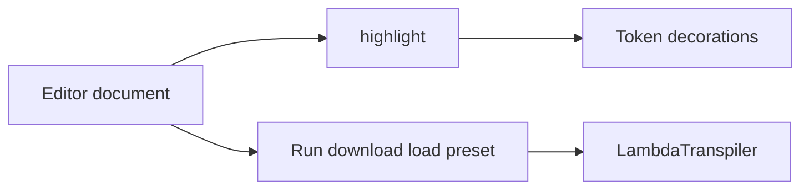

# Syntax highlighter for the playground

The program box in [website/index.html](website/index.html) becomes a CodeMirror editor. A separate scanner colors the source. [website/transpiler.js](website/transpiler.js) stays as it is.

## Scanner

Add [website/highlight.js](website/highlight.js), a pure function `highlight(source)` that returns `{ start, end, kind }[]` in order, with no overlaps, and never throws. Deno can import it, and so can the browser.

Kinds: `comment`, `text`, `directive`, `defName`, `define`, `lambda`, `param`, `dot`, `variable`, `name`, `paren`, `invalid`.

Scan rules, matching how programs are actually written:

- `//` through end of line is a comment, including on an `@` line.
- After optional whitespace at the start of a line, `#`, `?`, `!`, `*`, and `@` are directives. `@` then colors the rest of the line as text until a comment or newline. The other four color the rest of the line as an expression.
- Otherwise a line-leading `[A-Z][A-Za-z0-9_]*` followed by `:=` is a definition name, `:=` is `define`, and the remainder is an expression.
- `$` is `lambda`. Immediately following `[a-z]+` is `param` even when the `.` is not typed yet. The `.` that ends that run is `dot`.
- In expressions, `(` and `)` are `paren`, a single `[a-z]` is `variable`, and `[A-Z][A-Za-z0-9_]*` is `name`. Any other non-space run is `invalid`, and scanning continues after it.
- Whitespace produces no tokens. Empty input returns `[]`.

Add [highlight_test.js](highlight_test.js). `deno task test` already runs every `*_test.js` file. Cover a real definition such as `Succ := $nfa.f (n f a)`, an `@` line with a trailing comment, each directive, a half-written `$nfa`, junk text, and empty input.

## Editor

Vendor a small CodeMirror 6 build as [website/vendor/codemirror.js](website/vendor/codemirror.js): `@codemirror/state`, `@codemirror/view`, and `@codemirror/commands` only (history, default keymap, line numbers, active line). A script under `scripts/` installs those into a temp directory and bundles one ESM file with esbuild. Commit the bundle, not `node_modules`. [scripts/deploy_ftp.py](scripts/deploy_ftp.py) already uploads everything under `website/` except `node_modules`, so the bundle goes out with the page and does not depend on a CDN.

Replace the program `<textarea>` with a mount element. Wire [website/app.js](website/app.js) so Run, Download, Load `.lc`, and preset load read and write `view.state.doc`. On each document change, a view plugin runs `highlight` and applies `Decoration.mark` classes. The output box stays a textarea.

Style the editor in [website/styles.css](website/styles.css) to match the current page: white background, the same monospace, about 320px tall. Token colors stay on the light page palette: gray comments, blue `@` text, distinct colors for directives, definition names, parameters, variables, and names, and red for `invalid`. Give the editor an accessible name that replaces the current `label for="program"`.

## Check

Run `deno test --allow-read`. Then load the playground, confirm the prime preset is colored, type an incomplete lambda and see it update, and confirm Run, preset switching, download, and file load still use the editor text.
